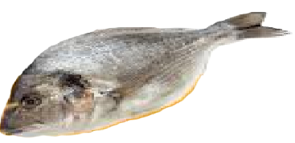

<div align="center">



<br>
<h3>Cile (Kile)</h3>
<h6>A very lightweight, evolving code editor written in C++ and Qt6</h6>

[](https://github.com/Minshel/Cile/blob/main/LICENSE)
[](https://en.cppreference.com/w/cpp/23)
[](https://www.qt.io/)
<br>

## [Project Roadmap](https://github.com/Minshel/Cile/blob/main/ROADMAP.md)

<h3>Contributors</h3>
<a href="https://github.com/minshel/Cile/graphs/contributors">
  
</a>

<h3>Build Guide</h3>

| Dependency | Minimum version |
|---|---|
| **[clangd](https://github.com/llvm/llvm-project/)** |  21.1.8 |
| **[Bmake](https://github.com/arichardson/bmake)** or **[go-task](https://github.com/go-task/task)** | 3.48.0 |
| **[Qt](https://www.qt.io/development/download-qt-installer-oss)** | 6.11.2 |

<br>
<h3>Fast Build</h3>

<div align="left">

<h5>NixOS:</h5>

```sh
nix-shell -p $(cat cile.dependencies) --run "task build"
```

<h5>Guix:</h5>

```sh
guix shell $(cat cile.dependencies) -- task build
```
